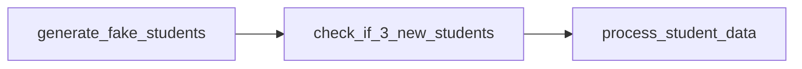

# Airflow Student Data Processing Demo

This project demonstrates how to use Apache Airflow to process student data. It includes a DAG that generates fake student records and performs transformations on them in batches of 3.

## Project Structure

```
airflow-demo/
├── dags/
│   └── student_processing_dag.py
├── data/
│   ├── students.csv           # Source data
│   └── processed_students.csv # Processed data with summaries
├── docker-compose.yaml
└── README.md
```

## DAG Workflow

The `student_data_processing` DAG follows this simple workflow:



1. **Generate Fake Student**: Creates a single student record with random data
2. **Check if 3 New Students**: Checks if the total number of students is divisible by 3
3. **Process Student Data**: If condition is met, processes batches of 3 unprocessed students by creating summary fields

## Setup Instructions

### Prerequisites

-   Git
-   Docker and Docker Compose (download at [Docker Desktop](https://docs.docker.com/desktop/setup/install/windows-install))

### Installation

1. Clone this repository:

    ```bash
    git clone https://github.com/nguyenit67/airflow-demo.git
    cd airflow-demo
    ```

2. Start the Airflow services:

    ```bash
    docker-compose up -d
    ```

3. Access the Airflow UI:
    - Open your browser and navigate to `http://localhost:8080`
    - Default login credentials:
        - Username: `airflow`
        - Password: `airflow`

## Running the DAG

1. The DAG is configured to run automatically every 5 seconds, generating one student record per run.
2. Once the total number of students is divisible by 3, the processing task will run.
3. The processed data will be stored in `data/processed_students.csv`.

## Monitoring

You can monitor the DAG execution in the Airflow UI:

-   View DAG runs in the "DAGs" tab
-   Check task status and logs
-   See the data generated in the `data` folder

## Implementation Details

The DAG uses TaskFlow API and consists of three main tasks:

1. `generate_fake_students`: Creates fake student records with random data
2. `check_if_3_new_students`: A short-circuit operator that checks if processing should occur
3. `process_student_data`: Creates a summary field by concatenating student information

The summary field combines name, major, GPA, and email in a human-readable format.

## Customization

You can modify the following parameters:

-   `num_students`: Number of students generated per run (default: 1)
-   Schedule interval: Currently set to 5 seconds (`timedelta(seconds=5)`)
-   Student fields and data generation logic in the `generate_fake_students` function
